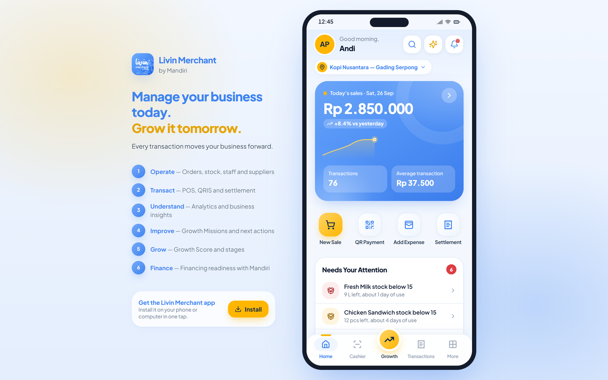
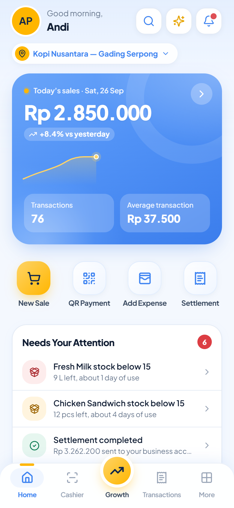
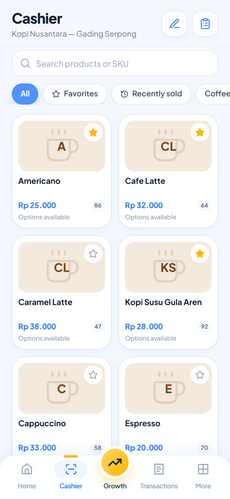
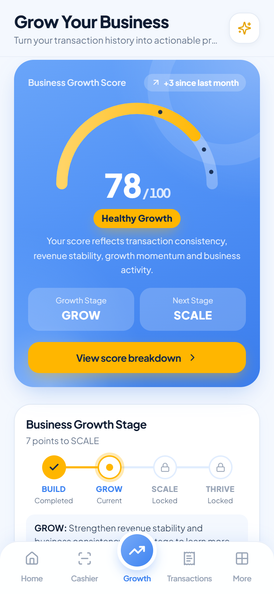

<div align="center">


# Livin Merchant — Upgrade Prototype

**From Processing Payments to Progressing Businesses.**

Prototype aplikasi *Livin Merchant by Mandiri* versi baru untuk final **SMBCC 2026**:
bukan sekadar alat terima pembayaran, tetapi *growth companion* bagi UMKM Indonesia.




</div>

---

## Tentang

Repository ini berisi dua bagian yang saling mendukung strategi **BEE — BEEyond Transactions**
(*Building the Value · Engaging the Market · Earning the Loyalty*):

| Folder | Isi |
|---|---|
| [`frontend/`](frontend) | Prototype interaktif Livin Merchant: web app mobile-first yang bisa di-install (PWA). |
| [`data-analysis/`](data-analysis) | Analisis survei 53 merchant UMKM sebagai bukti pendukung strategi, lengkap dengan 30 grafik siap pakai untuk deck. |

Alur inti yang ditunjukkan prototype:

```
TRANSACT → UNDERSTAND → IMPROVE → GROW → QUALIFY → ACCESS FINANCING
```

## Fitur Utama

- **Home**: penjualan hari ini, *Needs Your Attention*, snapshot Growth Score, cashflow, dan target harian.
- **Cashier (POS)**: varian dan add-on produk, diskon, cek stok, promo otomatis, serta pembayaran QRIS / debit / tunai / split.
- **Growth Engine**: Growth Score, Growth Stage (BUILD → GROW → SCALE → THRIVE), Growth Mission, Smart Insights, dan *Next Best Action*.
- **Financing Readiness**: faktor kesiapan pembiayaan dan rekomendasi produk (tetap bergantung pada asesmen Bank Mandiri).
- **Operasional**: transaksi, settlement, produk, inventori, supplier & purchase order, outlet, karyawan, pelanggan, promosi, dan laporan bisnis.
- **Explore Mode**: calon merchant bisa mencoba aplikasi dengan data demo tanpa perlu registrasi.
- **PWA**: bisa di-install ke home screen, tetap berjalan offline, dan mendeteksi versi baru secara otomatis.

<div align="center">



</div>

## Menjalankan Prototype

Prasyarat: **Node.js 18+**.

```bash
cd frontend
npm install
npm run dev       # http://localhost:5173
npm run build     # type-check + production build (termasuk service worker)
npm run preview   # jalankan hasil build untuk mencoba instalasi PWA
```

Di desktop, aplikasi tampil di dalam bingkai ponsel. Di HP, aplikasi memenuhi layar.

### Mode Demo untuk Presentasi

| Kebutuhan | Cara |
|---|---|
| Login merchant | **Login with Mandiri** dengan password apa pun (min. 6 karakter) |
| Coba tanpa akun | **Explore as Guest** |
| Panel presenter (tersembunyi) | Tambahkan `?demo=true` di URL, atau ketuk *App version* 5× di Settings |
| Ganti skenario | `?scenario=A` (sehat, skor 78) · `B` (hampir siap financing, skor 84) · `C` (masalah operasional) |
| PIN transaksi default | `123456` |

Semua data bersifat fiktif dan dibuat di perangkat. Hari bisnis dikunci pada **Sabtu, 26 Sep 2026 pukul 12:45** agar angka di semua layar selalu konsisten. Detail lengkapnya ada di [`frontend/README.md`](frontend/README.md).

## Analisis Data

Survei Google Form terhadap **53 merchant UMKM** (27–28 Sep 2026). Beberapa temuan kunci:

| Temuan | Angka |
|---|---|
| Pernah mendengar Livin' Merchant vs pernah memakainya (*Activation Gap*) | **68% → 0%** |
| Sudah menerima QRIS (pembayaran sudah jadi *baseline*) | **94%** |
| Memilih *business analytics* vs POS sebagai alasan memakai Livin' Merchant | **70% vs 30%** |
| Butuh satu aplikasi untuk transaksi dan operasional | **85%** |
| Termotivasi oleh level / milestone | **77%** |
| Lebih memilih reward pertumbuhan dibanding promo sementara | **74%** |

Isi folder:

- `livin-merchant-survey-analysis.ipynb`: analisis lengkap (profil, funnel, uji Likert Wilcoxon + koreksi Holm, segmentasi, persona, dan *evidence board*).
- `figures/`: 30 grafik PNG (220 dpi) dan `deck_headline_stats.csv`.
- `summary.md`: panduan pengisian slide appendix *Survey Profile*.

Menjalankan notebook:

```bash
pip install pandas numpy matplotlib seaborn scipy statsmodels scikit-learn wordcloud jupyter
jupyter notebook data-analysis/livin-merchant-survey-analysis.ipynb
```

## Deployment

Proyek sudah siap deploy ke **Vercel**. File [`vercel.json`](vercel.json) di root membangun `frontend/` dan menyajikan `frontend/dist` dengan SPA rewrite serta header cache untuk service worker. PWA membutuhkan HTTPS (atau `localhost`).

## Struktur Repository

```
.
├── frontend/
│   ├── public/            # ikon PWA, logo, screenshot
│   └── src/
│       ├── components/    # layout, cards, cashier, charts, growth, pwa
│       ├── context/       # Session, Data, Cart, UI provider
│       ├── data/          # mock data terpusat (merchant, transaksi, growth, ...)
│       ├── hooks/
│       ├── pages/         # onboarding, auth, home, cashier, growth, transactions, more
│       └── utils/
├── data-analysis/
│   ├── dataset.csv
│   ├── figures/
│   ├── livin-merchant-survey-analysis.ipynb
│   └── summary.md
└── vercel.json
```

---